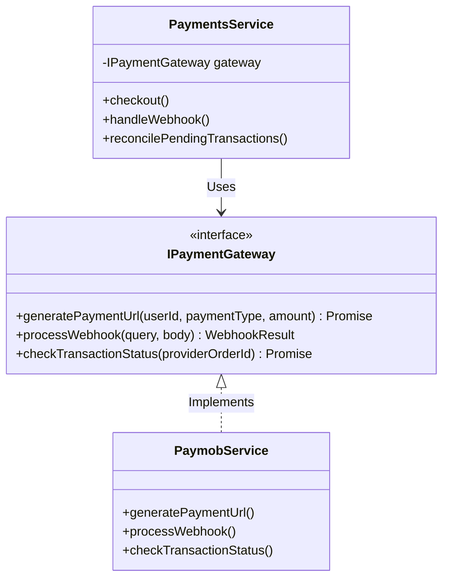
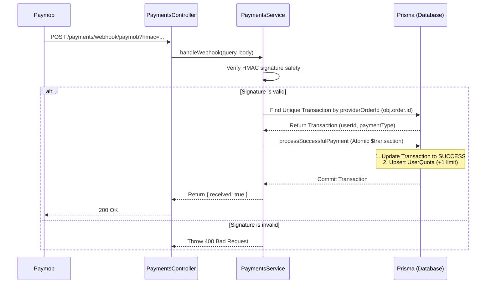

# Payments Module: Architecture & Integration Guide

This module provides a **gateway-agnostic, extensible payment strategy** for handling monetized user flows (like purchasing listing limits or offer packages).

---

## 1. Architectural Overview

The module utilizes the **Strategy Design Pattern** to separate core business logic from specific payment providers (e.g., Paymob, Stripe, PayPal).



### Core Components

1. **`IPaymentGateway` (Interface):** Defines the strict contracts that all payment providers must implement.
2. **`PaymobService` (Provider):** The implementation handling the Paymob 3-step checkout authentication flow and signature verification.
3. **`PaymentsService` (Core Orchestrator):** Controls the database transactions, handles quota allocations, and orchestrates the background cron job.

---

## 2. Core Flows & Data Flow

### A. The Checkout Flow (Initiating Payment)

1. Frontend makes a request: `POST /payments/checkout` passing `paymentType` and `amount`.
2. `PaymentsService` delegates URL generation to the active gateway (`PaymobService`).
3. The gateway registers the transaction details on Paymob and returns the checkout frame URL and the Paymob `orderId`.
4. `PaymentsService` logs a record in the database with status `PENDING` mapped to the generic `providerOrderId` (`orderId`).

### B. The Webhook Flow (Fulfilling Quota)

Since legacy Paymob checkout credentials do not pass custom metadata back in the webhook response, the verification flow uses the database state to resolve context:



### C. The Reconciliation Flow (Cron Safety Net)

Webhooks can fail due to network blips. To prevent users from paying without receiving their quota:

1. A cron job runs every hour: `reconcilePendingTransactions()`.
2. It fetches all `PENDING` transactions older than 30 minutes.
3. It calls `checkTransactionStatus()` on the active gateway.
4. If the gateway confirms that the order was paid successfully, the system automatically triggers the success handler and allocates quota.

---

## 3. Database Schema

The schema uses generic mappings to easily swap out payment providers:

* **`provider`:** An enum representing the gateway used (`PAYMOB`, `STRIPE`).
* **`providerOrderId`:** The gateway's registered order ID (used to match incoming webhooks).
* **`providerTransactionId`:** The actual financial transaction ID recorded when payment succeeds.

---

## 4. Local Testing & Verification

### A. Simulating the Webhook (Postman)

Because HMAC calculation is strictly verified to prevent forged payments, you must generate a correct signature to test the webhook.

1. Create a `PENDING` transaction by calling `POST /payments/checkout`.
2. Copy the Paymob order ID from your terminal logs or the database.
3. Run the following command in your terminal to generate the correct signature, replacing `YOUR_ORDER_ID_HERE` with the extracted ID:

```bash
node -e "
const crypto = require('crypto');
const secret = '88CE238A76E4BC965BFBEBBCA76BACEC'; // HMAC Secret
const fields = [
  '50000',                  // amount_cents
  '2026-07-21T02:00:00Z',   // created_at (mocked)
  'EGP',                    // currency
  'false',                  // error_occured
  'false',                  // has_parent_transaction
  '9999999',                // id (transaction ID)
  '5788951',                // integration_id
  'true',                   // is_3d_secure
  'false',                  // is_auth
  'false',                  // is_capture
  'false',                  // is_refunded
  'true',                   // is_standalone_payment
  'false',                  // is_voided
  'YOUR_ORDER_ID_HERE',     // order.id
  '1',                      // owner
  'false',                  // pending
  '1234',                   // source_data.pan
  'Mastercard',             // source_data.sub_type
  'card',                   // source_data.type
  'true'                    // success
];
const hmac = crypto.createHmac('sha512', secret).update(fields.join('')).digest('hex');
console.log('HMAC Token:', hmac);
"
```

1. POST to `http://localhost:3001/api/payments/webhook/paymob?hmac=YOUR_GENERATED_HMAC` with the webhook body structure found in Postman.

### B. Live Webhook Testing

To test live Paymob payments locally, run `ngrok http 3001` and update the **Transaction processed callback URL** in your Paymob Developers portal to:
`https://your-subdomain.ngrok-free.app/api/payments/webhook/paymob`

---

## 5. Adding a New Payment Gateway (e.g. Stripe)

Swapping or adding a payment gateway is straightforward:

1. Create a new service under `src/payments/providers/stripe.service.ts`.
2. Make it implement `IPaymentGateway`:

   ```typescript
   @Injectable()
   export class StripeService implements IPaymentGateway { ... }
   ```

3. Register the new service in `payments.module.ts`.
4. Inject it into `payments.service.ts` constructor instead of `PaymobService`. No other changes to the core orchestrator are required!
